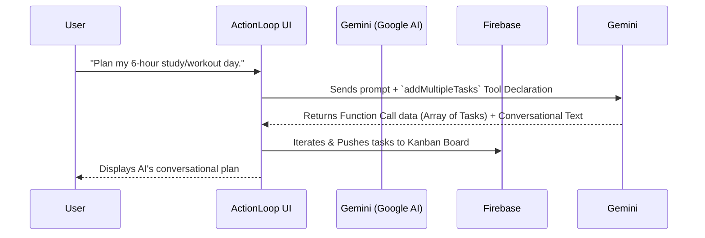

<div align="center">
  <h1>🚀 ActionLoop | Vibe2Ship Submission</h1>
  <p><strong>A hyper-vibrant, Agentic AI productivity suite built to keep you in the flow.</strong></p>

  [](https://react.js.org/)
  [](https://vitejs.dev/)
  [](https://firebase.google.com/)
  [](https://ai.google.dev/)
</div>

<br />

> **ActionLoop** seamlessly blends high-end aesthetics ("Vibe") with powerful, autonomous Google AI Studio-driven features to help you ship your goals faster. It is not just a chatbot—it is an **Agentic System** that manages your database.

---

## 🏆 Hackathon Evaluation Highlights

### 1. Agentic Depth (20%) & Google Tech (15%)
ActionLoop transcends typical wrapper apps by implementing **Function Calling (Tools)** via the `@google/genai` SDK.
The AI Coach doesn't just give advice; it actively constructs JSON arrays of tasks based on your unstructured constraints (e.g., "I have 6 hours, plan my workout and study time") and pushes them directly to your live Firebase Firestore database via a custom `addMultipleTasks` tool.



### 2. Product Experience & Design (10%)
Built with a heavy focus on modern web design, the app looks as good as it works.
- **Glassmorphism UI:** Frosted glass panels over a deep, dynamic background.
- **Interactive 3D Background:** Powered by `Three.js` and `@react-three/fiber`, reacting subtly to user presence.
- **Fluid Animations:** Spring-physics animations using `framer-motion` for every interaction.

---

## 🧠 Core Features

### 🤖 The Autonomous AI Coach
Stuck on what to do next? Feeling overwhelmed? 
The built-in **AI Coach** is a conversational agent specifically prompted to help you prioritize your day, regain focus, and stay motivated. 
- **Time-Boxed Scheduling:** Automatically structures your day and adds tasks to your board.
- **Micro-Stepping:** If you are procrastinating, the AI breaks your task down into 5-minute actionable steps.

### ✨ Magic Goal Breakdown
Big goals are intimidating. When you create a Long-Term Goal in ActionLoop, you can click **"Magic Breakdown"**. Google Gemini instantly processes your goal and automatically generates actionable, high-level milestones, turning a daunting dream into a structured plan.

### 📋 Full Productivity Suite
- **Dynamic Dashboard:** Get a personalized greeting and view upcoming deadlines at a glance.
- **Kanban Tasks & List View:** Manage your day-to-day workload with a fully functional drag-and-drop Kanban board.
- **Focus Mode:** A built-in Pomodoro-style timer that syncs directly with your active tasks.
- **Calendar:** A visual calendar to see your deadlines efficiently.

---

## 💻 Tech Stack

- **Frontend Core:** React 19, Vite, Vanilla CSS
- **AI / LLM Orchestration:** Google AI Studio (`@google/genai` SDK)
- **Animations / 3D Graphics:** Framer Motion, Three.js, React Three Fiber
- **Backend Infrastructure:** Firebase (Authentication & Firestore)

---

## 🚀 How to Run Locally

1. **Clone the repository:**
   ```bash
   git clone https://github.com/YOUR_USERNAME/actionloop.git
   cd actionloop
   ```
2. **Install dependencies:**
   ```bash
   npm install
   ```
3. **Set up your environment variables:**
   Create a `.env.local` file in the root directory:
   ```env
   VITE_GEMINI_API_KEY=your_gemini_api_key
   VITE_FIREBASE_API_KEY=your_firebase_api_key
   VITE_FIREBASE_AUTH_DOMAIN=your_auth_domain
   VITE_FIREBASE_PROJECT_ID=your_project_id
   VITE_FIREBASE_STORAGE_BUCKET=your_storage_bucket
   VITE_FIREBASE_MESSAGING_SENDER_ID=your_messaging_sender_id
   VITE_FIREBASE_APP_ID=your_app_id
   ```
4. **Run the development server:**
   ```bash
   npm run dev
   ```

---
*Built with ❤️ and 🤖 for Vibe2Ship.*
